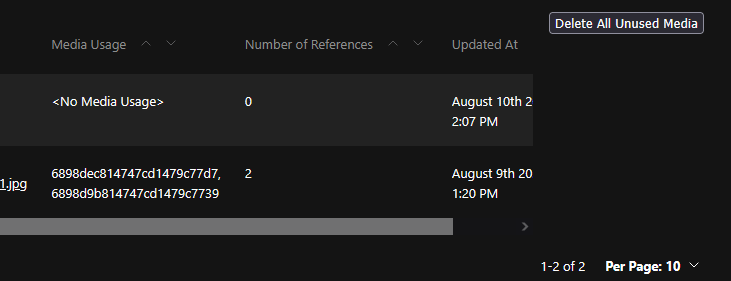

# Media Cleaner Plugin

> **Note:** This project is based on the official [Payload Plugin Template](https://github.com/payloadcms/payload/tree/main/templates/plugin).

A Payload CMS plugin to help you manage your media library by identifying unused media files and tracking where media is used throughout your project. This plugin makes it easy to keep your media storage clean and organized by allowing you to:

- Find all sources of media used in your Payload project
- Track where each media file is referenced on your website
- Delete media files that are not being used anywhere

## Features

- **Media Usage Analysis:** Scans your Payload collections and fields to find all references to media files.
- **Unused Media Detection:** Identifies media files that are not referenced anywhere in your content.
- **Safe Deletion:** Provides an interface to review and delete unused media files.
- **Usage Tracking:** Optionally, see where each media file is used across your site.

## Installation

Add the plugin to your Payload project:

```ts
import { mediaCleanerPlugin } from 'media-cleaner-plugin'

export const config = buildConfig({
  plugins: [
    mediaCleanerPlugin({
      enabled: true,
    }),
  ],
})
```

## Usage

Once installed and configured, the Media Cleaner Plugin will scan your media collection(s) and provide media usage information in the standard media view.



## Development

This repository includes a development environment in the `dev` folder. To get started:

1. Copy `.env.example` to `.env` and update the `DATABASE_URI` and `PAYLOAD_SECRET`.
2. Run the dev server:
   ```bash
   pnpm dev
   # or
   npm run dev
   # or
   yarn dev
   ```
3. Open [http://localhost:3000](http://localhost:3000) to access the Payload admin panel.

## File Structure

- **src/**: Main plugin source code
- **dev/**: Example Payload project for local development and testing
- **README.md**: This file
- **package.json**: Plugin metadata and dependencies
- **tsconfig.json**: TypeScript configuration

## Testing

Tests are written using [Vitest](https://vitest.dev/). You can find example tests in the `dev/int.spec.ts` file. To run tests:

```bash
pnpm test
# or
npm test
# or
yarn test
```

## Best Practices

- Provide an enable/disable option for the plugin
- Keep the dev environment simple for easy testing
- Integrate tests into your CI workflow
- Use [Semantic Versioning](https://semver.org/)

## Questions

For questions or support, please open an issue on the repository or contact the maintainer.

---

**Media Cleaner Plugin** helps you keep your Payload CMS media library organized and clutter-free!
